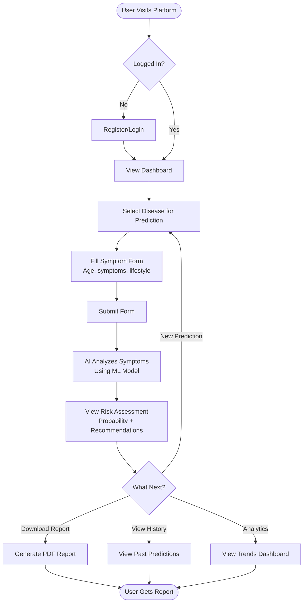
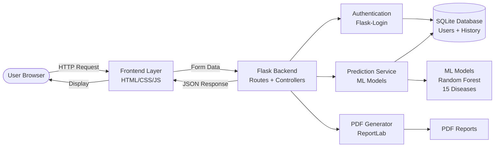
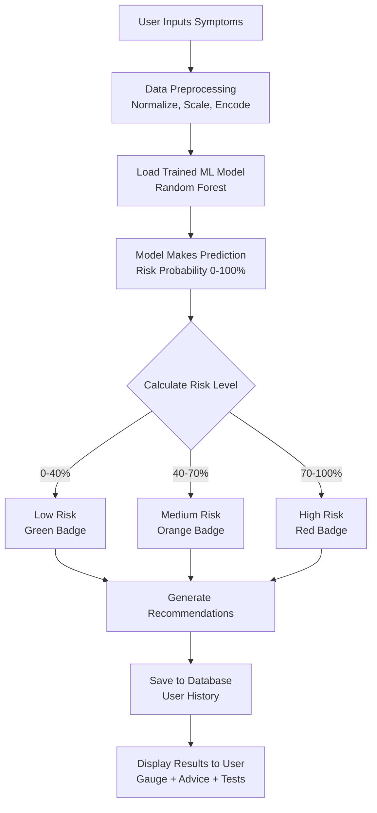
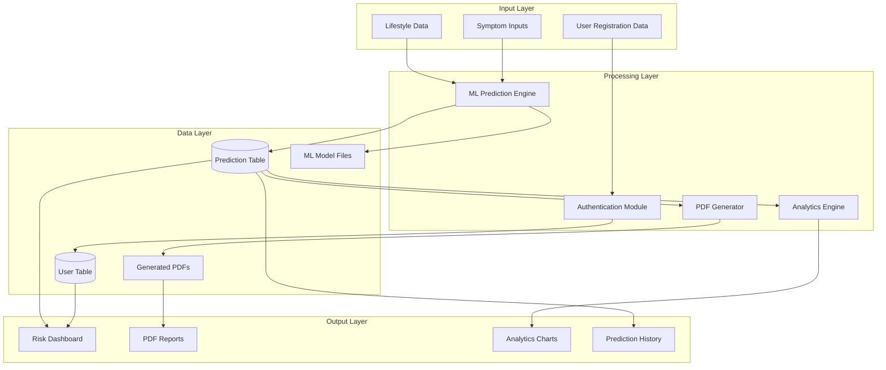
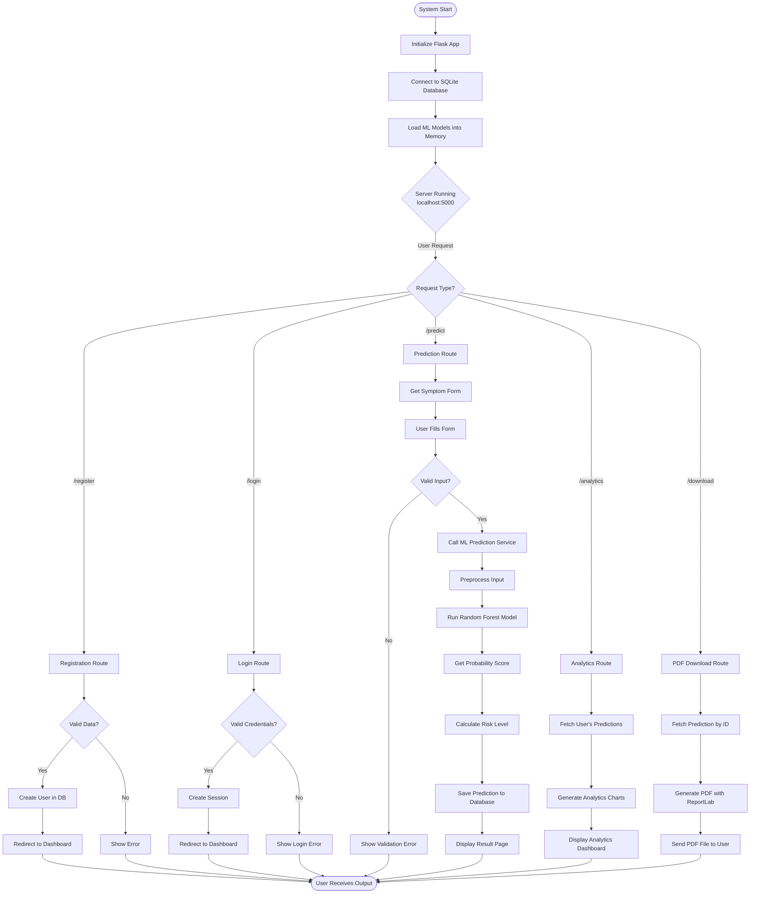
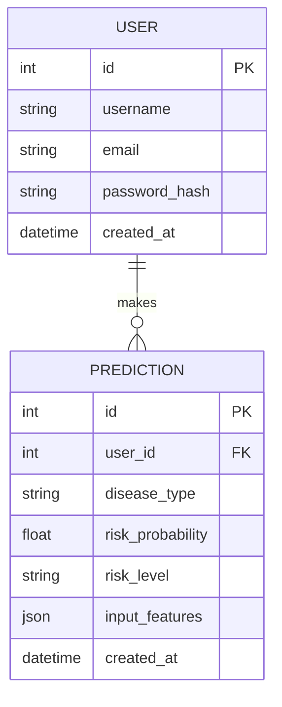

# 📊 System Flowcharts

## 1. User Journey Flow

---

## 2. System Architecture Flow

---

## 3. ML Prediction Flow

---

## 4. Data Flow Diagram

---

## 5. Complete System Workflow

---

## 6. Database Schema Flow

---

## Legend

- **🟢 Green** = Low Risk (0-40%)
- **🟠 Orange** = Medium Risk (40-70%)
- **🔴 Red** = High Risk (70-100%)

---

## How to Use This Document

1. **For Presentation**: Screenshot these flowcharts and add to your PPT
2. **On GitHub**: These Mermaid diagrams render automatically on GitHub
3. **For Viva**: Explain each flowchart to demonstrate system understanding

